# Mimita Live C++ Hot Reload Plan

## Status

The engine now has a real Windows DLL swap path. `mimita.exe` owns all runtime
state and loads `build/mimita-game.dll` from a uniquely named temporary copy.
The first migrated gameplay code is effect-particle simulation in
`src/effects/effect-part.cpp`. Effect pool memory, strings, rendering, replay
capture, OpenGL resources, and the singleton remain in the EXE.

This is not config reload or process restart. Saving `effect-part.cpp` causes
the running EXE to rebuild and load new native machine code.

## Architecture

```mermaid
flowchart LR
    Source["DLL sources\n(effect-part.cpp)"] --> Builder["build_game_dll.py"]
    Builder --> Stable["build/mimita-game.dll"]
    Stable --> Copy["unique live copy\nmimita-game-live-PID-N.dll"]
    Copy --> Loader["HotReloadSystem\nLoadLibrary/GetProcAddress"]
    Loader --> API["versioned GameAPI function table"]
    API --> Code["reloadable gameplay code"]
    Code --> Snapshot["POD snapshots/patches"]
    Snapshot --> State["EXE-owned world/player/NPC/effect/replay state"]
    State --> Renderer["EXE renderer/OpenGL/audio/network"]
```



The DLL never owns persistent engine objects. Calls enter the DLL only from the
main thread at frame/tick boundaries. The EXE copies reload-safe POD state into
the call and applies the result after the call returns.

## Current Exact Boundary

### DLL code now

- `src/effects/effect-part.cpp`, only its `MIMITA_GAME_DLL` branch:
  effect lifetime, velocity integration, gravity, sticky behavior, expiration.
- `src/hot-reload/game-api.h`: shared, versioned C ABI declarations.

### EXE code now

- `src/hot-reload/hot-reload-system.cpp`: timestamp polling, source rebuild,
  unique-copy loading, API validation, pointer swap, unload, cleanup.
- `src/effects/effect-part.cpp`, normal branch: `EffectPartSystem` singleton,
  pool allocation, spawn/replay capture, string destruction, rendering.
- `src/main.cpp`: process lifetime, engine initialization, frame loop, reload
  polling, shutdown.
- All other `src/**/*.cpp` files remain in the EXE in this first safe slice.

## Dependency Graph

```text
main.cpp
  -> Engine / GLFW / renderer / OpenGL
  -> World, Player, Camera, NpcSystem
  -> ReplayRecorder, ReplayPlayer, DuelManager, WeaponManager
  -> HotReloadSystem
       -> Win32 LoadLibrary / GetProcAddress / FreeLibrary
       -> build/mimita-game.dll
            -> GetGameAPI (extern "C")
            -> updateEffects(GameMemory, GameEffectPartState[])

EffectPartSystem (EXE)
  -> EXE-owned EffectPart[4096]
  -> GameAPI::updateEffects (DLL code)
  -> replay capture (EXE)
  -> DebugVis/ui/OpenGL rendering (EXE)
```

## Files That Must Stay In The EXE

- `src/main.cpp`
- `src/engine/engine-init.cpp`, `src/engine/engine-frame.cpp`
- `src/renderer/renderer.cpp`, `src/render/*.cpp`, `src/debug/debug-visuals.cpp`
- `src/glad.c`, GLFW/OpenGL initialization and all GPU object owners
- `src/audio/audio.cpp` and the miniaudio engine/device
- `src/network/client.cpp`, `server.cpp`, `net_common.cpp`, `packets.cpp`
- `src/world/world.cpp`, loaders, mesh/texture stores, asset loaders
- `src/replay/replay.cpp` recorder/player storage
- `src/gui/**`, until callbacks and GUI state are separated
- singleton/object storage for `EffectPartSystem`, `DeathSystem`,
  `AudioManager`, `Terminal`, `DevConfig`, `InputCommandSystem`,
  `NpcSelectionManager`, `OutfitAtlas`, and renderer globals

These files own OS handles, GL handles, threads/devices, allocators, STL
containers, callbacks, or long-lived objects. Unloading their defining module
would invalidate destructors, virtual/function pointers, or static storage.

## Safe DLL Migration Candidates

Move code, not ownership:

- Pure effect integration and spawn-shape calculations.
- Movement intent, tuning, and pure math after Player/World access is exposed
  through stable snapshots or narrow platform callbacks.
- NPC sensing, utility scoring, and action selection. Keep `NpcSystem::npcs`
  and each `Player body` in EXE memory.
- Weapon spread, cooldown decisions, hit/damage calculations. Keep audio,
  renderer, effect pool, killfeed strings, and replay capture behind EXE calls.
- Duel phase transition rules. Keep `DuelManager` vectors/strings in EXE memory.
- Replay gameplay event construction. Keep recorder/player vectors and file IO
  in the EXE.

## Files Requiring Refactoring Before DLL Migration

- `src/sim/simulate-tick.cpp`: directly calls physics, NPC, collision, death,
  logging, and accesses concrete object layouts.
- `src/physics/physics-mini.cpp` and `src/physics/movement/*.cpp`: mutate the
  large `Player` object and call effects/debug/GLFW-facing helpers.
- `src/npc/npc.cpp`, `npc-combat.cpp`, `npc-navigation.cpp`,
  `npc-state-machine.cpp`: own/use vectors, strings, player bodies, audio,
  effects, selection, rendering, and physics.
- `src/combat/revolver-system.cpp`, `weapon-manager.cpp`, `weapon-hit.cpp`,
  `death-system.cpp`: depend on renderer globals, textures, terminal, audio,
  effects, replay, NPC containers, and EXE singletons.
- `src/game/duel.cpp`: mixes phase logic with map loading, UI rendering, and
  NPC/world mutation.
- `src/replay/replay.cpp`: owns STL storage and file serialization.

The migration sequence is to split each into `state owner`, `pure update`, and
`platform effects`, then add a versioned POD entrypoint to `GameAPI`.

## Circular Dependencies

- Physics -> Player -> effect/audio helpers -> replay is a gameplay/platform
  cycle.
- NPC -> physics -> Player, while combat -> NPC -> effects/death -> NPC.
- Duel -> NPC/World/Player and map loading; its HUD also points back to GUI.
- Weapon -> renderer textures and camera, while Player rendering owns weapon
  presentation data.
- Audio -> replay capture, while replay scene capture reads gameplay objects.

The DLL must not link these EXE C++ symbols directly. Break cycles with the
`GamePlatformAPI` service table and POD requests/results.

## Globals, Statics, And Singletons

Unsafe persistent statics include:

- `gRenderer`, `gTextures`, OpenGL VAO/VBO/texture statics.
- miniaudio `gEngine`, active sound vector, audio clocks.
- `gActiveReplayRecorder`.
- function-local singleton instances across audio, effects, death, terminal,
  dev tools, input, selection, and outfit systems.
- main-local static replay, duel, key-edge, mouse-edge, and GUI state.
- collision diagnostic cooldowns and renderer frame timers.

No persistent static may be introduced in DLL code. DLL statics reset every
reload and their destructors execute during `FreeLibrary`. Persistent data must
live in `GameMemory` or an EXE-owned object.

## Function Pointer Safety

- The EXE stores only the current `GameAPI` table.
- A candidate DLL is copied, loaded, and fully validated before the current
  table is replaced.
- Old callbacks are invoked only before `FreeLibrary`.
- No DLL function pointer is stored in entities, terminal commands, replay
  records, GUI callbacks, jobs, or other long-lived objects.
- Reload is main-thread-only; no worker may be executing DLL code during unload.

Future job-system support requires a reload barrier and active-call counter.

## OpenGL And Allocator Ownership

The DLL does not create, bind, delete, or cache OpenGL resources. Renderer,
GLFW context, GLAD function pointers, shaders, textures, buffers, and font
resources stay in the EXE.

The DLL does not allocate memory that survives a DLL call. No `std::string`,
`std::vector`, exception, RTTI-owned object, or owning pointer crosses the ABI.
The current effect API uses fixed-width scalars and caller-owned arrays.

## Reload Lifecycle

1. The EXE polls DLL sources from the main thread.
2. A newer source timestamp logs detection and runs `build_game_dll.py`.
3. The builder writes `mimita-game.build.dll`, then atomically replaces the
   unlocked stable `build/mimita-game.dll`.
4. The EXE detects the stable DLL timestamp.
5. It copies the stable DLL to `mimita-game-live-PID-generation.dll`.
6. `LoadLibrary` loads the candidate and `GetGameAPI` resolves the C export.
7. Version, table size, required pointers, and `onReload` are validated.
8. The EXE swaps to the new table.
9. It calls the old `beforeUnload`, unloads the old unique copy, and deletes it.
10. Simulation continues against the same EXE-owned memory.

If build/load/API validation fails, the old DLL and function table remain live.

## Build Workflows

Existing build:

```powershell
python build.py build-only
```

DLL only:

```powershell
python build_game_dll.py
.\build-game-dll.bat
```

CMake with Ninja:

```powershell
cmake -S . -B build-ninja -G Ninja
cmake --build build-ninja --target mimita-game
```

When `mimita.exe` is running, saving a watched DLL source automatically invokes
the Python DLL build and swaps the resulting code.

## Risks And Remaining Unsafe Systems

- The automatic compiler currently runs synchronously and can hitch one frame.
- Source polling currently watches the first DLL source and API header; expand
  the manifest as modules migrate.
- Structural ABI changes require bumping `MIMITA_GAME_API_VERSION` and an
  explicit memory migration.
- Reload while another thread executes DLL code is forbidden.
- C++ exceptions must not cross the ABI.
- Movement, NPC, weapon, duel, and replay logic are not yet DLL-owned; moving
  them wholesale today would be unsafe because of direct singleton/STL/GL
  dependencies.
- Crashing inside new DLL code is still a process crash; guarded rollback only
  covers build/load/API validation failures.

## Migration Plan

1. Keep this effect update slice as the ABI/load/unload proof.
2. Add automated reload stress tests and an active-call reload barrier.
3. Split `simulate-tick.cpp` into EXE services and DLL orchestration.
4. Move movement pure math one subsystem at a time, preserving Player storage.
5. Move NPC sensing/scoring/decision code, preserving `NpcSystem` storage.
6. Move weapon and duel rules behind explicit audio/effect/map/UI requests.
7. Move replay event construction, preserving recorder/player ownership.
8. Add schema/version migration for DLL permanent storage if it becomes needed.

## Future Expansion

- Hot reload shaders through renderer-owned program replacement.
- Hot reload textures while preserving stable texture handles.
- Explicit map reload/editor transactions with rollback.
- Reload UI behavior without replacing GUI state or GPU resources.
- Animation graph/data reload.
- Live editor integration and compile diagnostics overlay.
- Background Ninja builds with debounce and cancellation.
- DLL symbol/PDB generation and crash attribution by generation.
