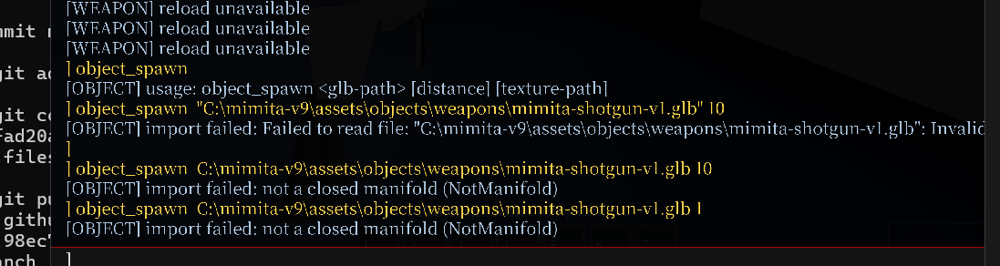

# TODO
# TODO
# TODO
# todo sorted by like, leverage? or what is most important do that first 

## 1. destructilbe objects
destructilbe objects + phsics: 
get them to move again, get the holes to be cut based on the force of the hit im hitting it with, make projectile rifle work first, then other weapons e.g. hitscan, explosion, melee 

right now crate wont move , and big big fps drops when i touch it 2026 09 29 0907

2026 09 30 1056 - crate moves!!! issue is the tipping logic, need it to tip over faster, not like slow down while its tipping over
also, we are testing witht he projectile rifle:
the mass of the projectile/density etc, and speed, all this shouldl equivalent to like a force

so me, shooting the crate with  projectile rifle, e.g. straight head on shot at like 200 m/s projectile with  
projectile speed of 500.0 rightn now, todo confirm units? 500 m/s? is that accurate? 
and projecitle dnesity of 7800.0, todo confirm units? liek kg cubed? idk 

so that math, should equivalent , and again this is just a sphre im shooting right now i think? todo later  we nede to expand it to be arbitary whatever triangles, get the angle and force and etc of each triangle vs the thing we're hitting, its triangels

so then i shoot the crate with this projectile, like head on
that means = 
since crate is solid,
i should instnatly have a client predicted hole in the crate. as well as, get crate's density, if its low = the force of the bullet pushes it based on density. e.g. high speed + high dens bullet + low dens crate = big push for crate, adn big hole.

but right now, i shoot it 2026  09 30 1059 i shoot it w projectile rifle, it does nothing. so we need to make it os, me shooting with projectile rifle, no tunneling either, shooting with the projecile  makes a hole appear.
shooting multiple times = multiple holes. shooting same spot multiple times = keeps making teh hole go depeer until eventualy you cut a hole thru it and can walk thru it/see thru the hole. thats super huge i want to do that 

try not to brute force at the start i think? idk? copy other  effiicent collisions logic patterns and do that here
i wnat this to be like somewaht realistic, and overpowered. e.g. this rifle is like a minigun functinally, it has 999 bullets, i wnat to fire all bullets at the crate and see all 999 make a hole or effecet the crate somehow 

big vision: 
edit a gun's bullet speed to be 1,000x its normal value, shoot a building = emergent effecets, the building explodes, bullet continues thru the building, it falls over, hits things behind it, building falls onto other buildings and they are destructed too based on density and material properties and angle and force etc
shoot  a player = chunks fly ouf o f them, holes cut in the player's body. make a player super dense = takes a lot to  destroy that player, good for  super strong bosses. make a  player weak = good for human or weaker players, realsitic modes e.g. shotgun  to head = holes in head , holes in body if shot in body, blood, etc, more realistic liek that 

psuedo plan 2029 09 30 1104 jorj 
The best implementation order is:
1. Make server-side projectile rifle hits visibly cut the crate.
2. Add client-predicted entity impact/hole presentation.
3. Replicate authoritative cuts and reconcile prediction.
4. Tune tipping/righting and update mass/inertia after material removal.
5. Add hitscan, explosion, and melee through the same ImpactSystem.
6. Only afterward expand from crate planar cuts to arbitrary GLB/triangle geometry.

attempt 1 2026 09 30 1135 jorj
it did become smaller after i hit it, 
but it like, 
it was over the entire crate, not jus tin the spot ihit.  
whole crate got smaller, instead of just making a hole where i shot it 
then, after shooting it like 100 times
 it started to just have like some triangles of it cut out.
  but not where i shot. 
  it did not update the holes like live as i was shooting it more 
it also got fps drops as i got close to it and collided with it more

i wnat to shoot a spot on the crate, then, that spot is like, sphere boolean deletion, or capsule idk. 
then, that is made of triangles, not just like a perfect sphre/capsule, and each triangle can have like idk juts copy the parent cube texture 

whats wrong? can u make a plan for a different agent  to look into it and do  more like code for i t? or looking into exact whats wrong? act for now as, knowing what the gaps are and waht someone should do to fix them, but dont fix , just explain what exact is not going right and how to do it differnet 

frmo gpt 5.6 luna medium bc i think  deepseek v4.1 flash can do better matbe idk?
Handoff plan for another agent
Phase 1: Prove the exact failure
Add bounded diagnostics for one crate:
projectile impact position
projectile entity id
target crate id
client/server side
number of stored cuts
cut local position
cut radius
triangle count
geometry revision
render upload revision
Acceptance:
one shot = one cut
cut position matches the shot
geometry revision increases once
render revision updates once
Phase 2: Stop the whole-crate shrinking
Change the boolean grid so it has an outside-air border:
real crate:
[-halfExtent, +halfExtent]

sampling grid:
[-halfExtent - cell, +halfExtent + cell]
Add a self-test:
uncut outer corner remains at the original crate size
Phase 3: Make the hole follow the shot
Replace the fixed coarse whole-crate grid with local refinement:
far from cuts:
    large cells

near cuts:
    small cells
For the current human-scale crate:
normal area: about 0.25 m cells
near a bullet hole: about 0.02–0.05 m cells
The mesh should be rebuilt only around the union of nearby cuts.
Acceptance:
shot at left side → hole on left side
shot at right side → hole on right side
same spot repeatedly → same cavity gets deeper
Phase 4: Make the client and server agree
Create one compact cut event containing:
crate id
cut id
simulation tick
cut center
cut direction
cut radius
cut shape
energy
The client may show the predicted cut immediately.
The server confirms the cut.
If prediction and server result match, keep it.
If they differ, rebuild from the server’s stored cut list.
Phase 5: Improve projectile shape
Start with:
sphere impact
Then add:
capsule along projectile path
A capsule gives the bullet a real tunnel instead of only a front dent.
Later:
custom projectile mesh
explosion sphere
melee volume
Phase 6: Fix texture coordinates
The current generated triangles use a simple global projection. That is why they may not inherit the crate’s cube texture correctly.
Each generated triangle needs either:
- the original face’s material and UV mapping; or
- a stable projection based on its surface normal.
Phase 7: Add breaking pieces later
Only after the cavity is correct:
calculate remaining solid volume
find disconnected solid regions
split them into separate PhysicalEntity objects
recalculate mass and inertia
Do not start fracture yet. Right now the first target is:
one shot
→ correctly located 3D cavity
→ live client update
→ matching collision
→ no FPS drop
The most important first fix is the mesh grid: add the outside border and local refinement. That explains both the shrinking crate and the holes appearing in the wrong places.

2026 09 30 1358 jorj im like he whatsup hello

Final plan
Milestone A — vendor + build the dependency (first execution task)
1. git submodule add https://github.com/elalish/manifold.git external/manifold, then check out tag v3.5.4. Record exact commit hash, version, LICENSE path (Apache-2.0), NOTICE, and a clean git status inside the submodule.
2. Configure/build a static, Release, C++-API-only lib with the game's g++:
-DBUILD_SHARED_LIBS=OFF -DMANIFOLD_PAR=OFF -DMANIFOLD_TEST=OFF -DMANIFOLD_CBIND=OFF -DMANIFOLD_PYBIND=OFF -DCMAKE_CXX_COMPILER=C:/important/msys64/mingw64/bin/g++.exe, generator Ninja from the winlibs dir, install to external/manifold-prebuilt/.
3. Record the produced library path (external/manifold-prebuilt/lib/libmanifold.a) and exact commands.
4. Smoke probe in tools/manifold_probe.cpp: Cube(1) − Sphere(0.6), assert Status()==NoError, print pre/post Volume, MeshGL counts, mergeFrom/To + run*/faceID behavior; confirm closed. Run it and record output.
Milestone B — MiMITA-owned wrapper (no Manifold types in game code)
- New src/impact/boolean-mesh.h: BooleanMeshVertex{pos,normal,uv,materialId}, BooleanMesh{vertices,indices}, BooleanCutterType{Sphere,Capsule}, BooleanCutter{type,localCenter,localDirection,radius,length}, BooleanCutOutcome{success,mesh,remainingVolume,triangleCount,componentCount,error}.
- New src/impact/boolean-mesh.cpp: the only translation unit that includes <manifold/...>. Builds a canonical 24-vertex/12-tri textured box with mergeFrom/mergeTo, synthesizes capsules as Cylinder ∪ 2×Sphere, does Manifold(base) − cutter(N)..., maps MeshGL back to BooleanMesh, and maps Manifold::Error to MiMITA diagnostics.
Milestone C — wire the first gameplay cut (replaces the surface-nets path)
- Extend DestructibleGeometry (src/impact/destructible-geometry.h) to hold the canonical base mesh + ordered cutter history (authoritative) plus current output cache + geometryRevision.
- Rewrite DestructibleGeometrySystem::rebuild to call the wrapper; delete src/impact/box-surface.cpp/.h (the shrink/misplacement owner).
- ImpactSystem::submit builds the cutter from the existing energy/radius math and local-space inverse transform; dedupe by explicit cut id; only swaps geometry and bumps revision once.
- Preserve PhysicalEntity identity, position, orientation, linear/angular velocity, density, mass/inertia; no respawn, no second physics owner.
Milestone D — build + perf
- Add Manifold include/link to build.py (INCLUDE_FLAGS + link line) consistent with the libjuice pattern; add a tools/build_manifold.py helper so it is regenerable.
- Bounded diagnostics per cut (triangle counts, volume, status, boolean/convert/collision-rebuild timings, revision).
Milestone E — tests
- Update destructible-selftest.cpp for: valid cube−sphere, hole at exact spot, small cutter does not shrink crate, no-op when not touching, pass-through tunnel, repeat deepens, winding/manifold, volume decrease, triangle bound.
- Keep --moving-crate-selftest passing. Build with python build.py build-only; run both --destructible-selftest and --moving-crate-selftest.
Milestone F — docs
- Write docs/specs/manifold-destructible-integration-plan.md (ownership rules, wrapper, local-space flow, preserve-entity rules, first slice, prediction/replication determinism, texture/UV handling, diagnostics/perf, acceptance tests, risks, next-agent instructions). Networking documented as a later slice with a concrete cut-event packet design, since no crate entity/cut packet exists today.
- One changelog under docs/changelog/2026-09-30/, including the two spec TODO flags at destructible-world.md:1 and moving-physical-objects.md:1.
Evidence separation: source inspection, dependency build, MiMITA build, selftest, runtime, and human/visual acceptance will be reported as distinct claims. Visual/multiplayer acceptance will be explicitly left to human review.
Two residual risks to flag: CMake 4.2 compatibility with Manifold's CMake (verify at configure), and static-lib ABI (mitigated by building with the game's GCC 16.2).
This plan modifies gameplay code, adds a submodule, and writes files — all of which require leaving Plan Mode. Shall I proceed?

2026 09 30 1624 jorj - ok 
its holes are cutting 
big big lag tho, cutting a hole then getting close = big like fps disp not good, more efficent collisions probablt need to be done
holes not accurate to projectile size in weapons.json for projectile rifle i think?

also, ideal = shooting it 1 time = a hole made. shooting 1 hole over and over = deeper hole each time.
currennt = i shoot it like 30 times = maybe one or two holes are made. why? not good. need all shots to make a hole
shooting over and ovr the same spot doesnot make a hole it just makes like one maybe, ver ver inconsistnet hole making. 
havent been able tto test fracturing, just
the next pass should be about  making the performancebetter, e.g. if i touch it  , dont make a big fps drop lag spike, and , amke it so shooting it = a hole is made or hole is made better, so i can shoot a tunnel thru the object, and the projectile size is influenceing the hole size
im using crate_spawn too for this 

object_spawn

has this error, not a closed manifold, ignore that for now tho, just focus crate_spawn

pass 2 2026 09 30 1655 jorj
its doing much better, less lag, still some lag, but i can shoot holes and it cuts holes when doing crate_spawn thats great

now, the issue is, shooting the same hole i just mad e, wont cut a hole, need it to cut a hole again. and maybe simplifiaction? or triangel combinations? so we dont just split triangles over nad ove nad over 

and as well as still some big lag issues when cutitng a lot of hoels at once. so , might be, a queue or sometihng? just handle as much work as u can that frame/that tick then dont do antthing else? not sure, maybe client instant predicts smth small and msooth, then server does the queued hole cutting? i dont want to have lag tho, so not sure about what to do here.

so, just need to make it so , holes can also be shot, and then can be destrucetd even furhter. as well as , more perfomrnace increases, bc when shooting a bunch of projectiles at it super quick it gets super laggy there , not good , not sure what to do there tho

## 2. infinite procedural world NOT inf dgn slr
inf procedural world: just  make that 100x100 city block repeat over and over, like , i can go like 10,000 m /s and it will still generate over and over, asd well as it wotn render things like more than 1000 meters away? or fade them out? idk 

# TODO BUT LATER
# TODO BUT LATER
# TODO BUT LATER
# TODO BUT LATER
# TODO BUT LATER
# TODO BUT LATER
# TODO BUT LATER
# TODO BUT LATER
# TODO BUT LATER
# TODO BUT LATER
# TODO BUT LATER
# TODO BUT LATER
# TODO BUT LATER
# TODO BUT LATER
# TODO BUT LATER
# TODO BUT LATER
# TODO BUT LATER
# TODO BUT LATER
# TODO BUT LATER
# TODO BUT LATER
# TODO BUT LATER
# TODO BUT LATER
# TODO BUT LATER
# TODO BUT LATER
# TODO BUT LATER
# TODO BUT LATER
# TODO BUT LATER
# TODO BUT LATER

## 3. npc behavior

doing this better unlocks
flying monsters, 
crawling, 
stationary mosnters that spawn monsters, 
small monsters, 
HUGE monsters
sniper monsters
hovering wyvern  monsters
mimic player monsters
bossfights WE NEED A BOSSFIGHT MAKER BRO PLZ 

for inf dgn slr, better path finding, counter strike mode, bomb tag, that should just be its whole own thing yonestly 

## 4. aimbody, physical movemnet, arm sway, retrograd/source engine

2206 09 30 1036 jojr - now all we need is the arms to be sticked to their spot better and thats cool

## 5. smoothest collisions ever 
2026 09 30 1037 jorj - i might just leve this for now but idk  cuz its not even idk bro whatever 

## 6. cleanupppppp
full is here  C:\mimita-v9\docs\specs\20260929plan.md
not cleaning up right now i tihnk 

# gamemodes counter stirke 
6. gamemodes, conuter strike

need: actor presets , doing that  as of 2026 09 29 1355 jorj 

need: gui like, whos alive on what team, fix tab leaderbaord gui to shwo that better
show what round it is, wht time is left in teh round

make this gui code like hot reloadable!!!!!!!!!!! dont make it so  i need to edit one thing over and over and ove r to fix and figure out etc , just make it so the gui works and shows what we intend for it to show

need: 
npc ebahvior better, 
like, actor roles that meaan, 
u dont attack people on my tema, 
onlt epople on the other team. 

also, better path finding, lik ebehaviors? 
dont run into the wall oevr nad over,
 go to where u actaullt are allowed to walk
  dont just run into the wall etc 

# fractal world
2026 09 30 1656 jorj  i want to do thssss so baddd and portals and vehicles and caravan mode and xombie tower but whareev 

## 0. why
npc behavior first? matbe, bc makes all future things better. but, need procedural world for npcs to move in!, need destructible blocks to wokr so they know what to do!, need moving objects so they know how to work with them!

moving objects first: well we kinda alr did that before, so idk, combo with destructible

moving + destructible obejcts: seems difficutl? evidence was, took a lot of iterations in roblox to do destructble objects right. but, if done right, then, antthing u see can be destructed. that is siiiiick i love that i wan tto do that. 
especailly if its just triangles. then we cna have PSX style mesheswith holes cut out of them!!!!

inf procedural world: made of objects, also seems kinda easy? idk. just repeat it over and over , and system technicallt exists rn jsut kinda bunz 

aimbody: whatever, itts like one prompt

cleanup: idk deferred not for now. do  as we go along, clean as we go!

gamemodes: should naturally emerge from all thees otherhtings. also, gui and stuff emerge from it as well, so idk . ALSO NEED SOUND EFFECTS FOR WAVE START AND ROUND START ETC AND SOUND EFECTS OVERALL

content overall: NEW AVATRS, new textures, NEW MAPS PLEASE, LIKE 10 NEW MAPS, MORE LIKE THE GOOD ONES, FINISH EXISTING MAPS!!!! EXPAND THE MALL MAP TO BE SUPER HUGE.
1 super big map, or bunche sof smaller maps? idk.
more music, MORE WEAPON MODELS!!!! MROE WEPAON SOUNDS!!!!! 
etc

conclusion: moving  destructible objects first, FULLY DO THOSE, e.g. glb can get holes cut too, as well as glbs can move, denisty editable, its moving = i can move on it while it moves etc.
