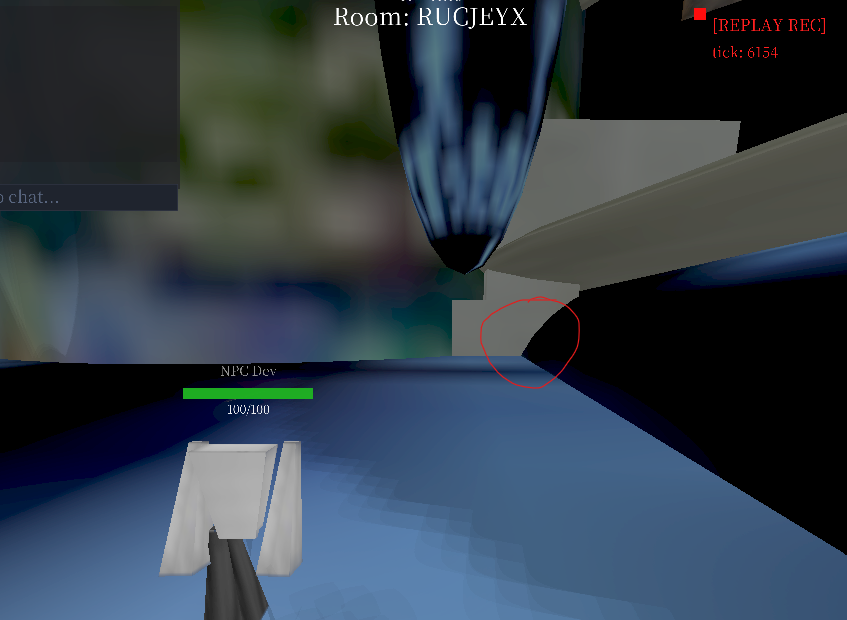
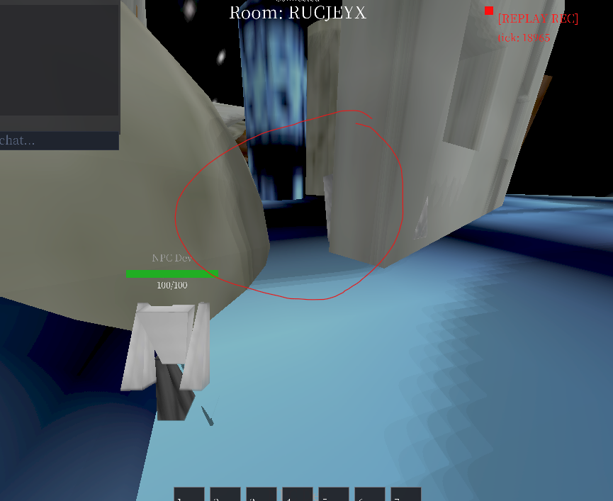
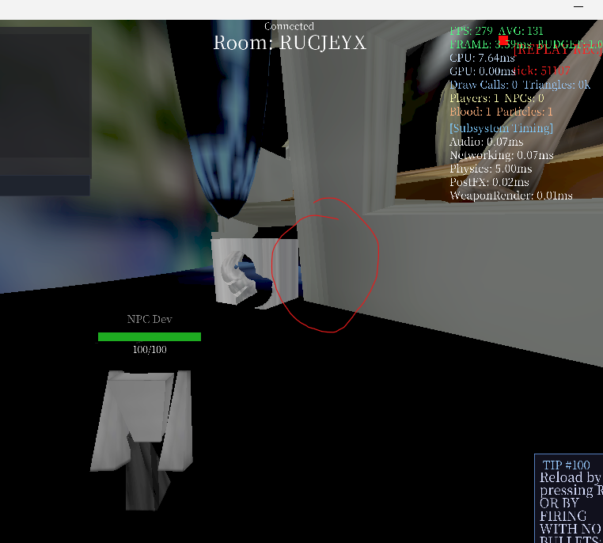
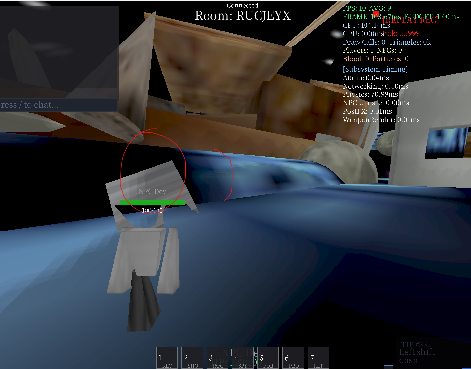

# TODO
# TODO
# TODO
# todo sorted by like, leverage? or what is most important do that first 

## 1. destructilbe objects
destructilbe objects + phsics:  C:\mimita-v9\docs\specs\destructible-world\destructible-world.md

big vision: 
edit a gun's bullet speed to be 1,000x its normal value, 
shoot a building = emergent effecets, the building explodes, 
bullet continues thru the building, 
it falls over, hits things behind it, 

building falls onto other buildings, 
they are destructed too, 
based on density and material properties and angle and force etc,

shoot  a player = chunks fly ouf o f them, 
holes cut in the player's body. 

make a player super dense = takes a lot to  destroy that player, 
good for  super strong bosses. 

make a  player weak = good for human or weaker players, 

realsitic modes e.g. shotgun  to head = holes in head , 
holes in body if shot in body, blood, etc, 
more realistic liek that 

pass 4 continued from C:\mimita-v9\docs\specs\20260930plan.md
2026 10 01 0948 jorj - sas i need to test the projecitle things testing
i need to make it just running all the timte the mimta exe

pass 4 2026 10 01 1139 joorj - discord  i was on discord for like 1 h , tracking with a stopwatch, thtas good, spend more time here

I CAN WALK THRU CRATES!!!! ITS GOOD i acn walk thru holes i cut!!!
fracturing does work just not tuned correct? antthing that is floating, any part of it that is not supported should fall. as well asl, the falling peices need to collide withthe world 
HOEL CUTTING WORKOS!!!! HOEL CUTRTING ON HOLE CUTS WOKRS Just

we had a crash, not sure hwy 
"C:\Users\guita\AppData\Local\Mimita\crashes\crash-2026-10-01_11-36-15-20384.dmp"
"C:\Users\guita\AppData\Local\Mimita\crashes\crash-2026-10-01_11-36-15-20384.txt"
its in these 

"The crash report itself is only a wrapper report: it says the process died with an unrecognized exception code at KERNELBASE.dll, so it does not identify the game function. I’m narrowing it now by comparing the current HEAD commit (“destructible world crashed”) with the exact geometry/cache/fracture code and the minidump’s available metadata." from gpt 5.6 luna medium  
https://chatgpt.com/s/cx_6abe7efd0d008191b042b948bfdc56b7

so, next attempts should be  number one do not do crashes, but number two, performance fixes and texturing fixes?
i make 1 hole then the entire crate becomes a weird like stretched texture
which i want it to b elike, not like thta , i want it to be like hmmmmmm
like just the normal texture and then stretched to be across all the triangles 
or, could even just repeattexture? im not so sure
maybe internal texuress of holes has their own texture? im not sure 

but the main things are do not crash, perofrmance increases
then i think, dont do effects yet, wenede to expand to arbitrary .glb meshes i can spawn, which means object_spawn needs to work

need to add object_spawn.list ? or _list? idk
but it lists all objects in the game's object folder 

"C:\mimita-v9\assets\objects\things\physics-objects" use this , all these are read by the list command, then i can do 

object_spawn_list = lists all the things in this fodler, alphabetical order, number order

so if "C:\mimita-v9\assets\objects\things\physics-objects\5x5x5-cone.glb"  is first, its number is 1 

so i cna do object_spawn 1 = it spawns this object in front of me

i can do the same for any other object

these obejcts all should also be destructilbe, same as the crate

but we should do like, separation first. bc, if u shoot  a lot out of the crate, and a floating piece exists, it wont fall. it needs to fallif it is floating, and also do damage to other htings that are destructible. 

but, crash fix first, performance second, pieces fall when not supported 3rd, random glb import 4, all waepons supported 5, effects 6, gamemodes based around it 7 

crate collisions ar notttt the way i want them to be, they have big big lag issues when on clinders, and when plaer is near the crate. so need to  have a more effiicent collisions, like much much more efficient i believe 
crate coliisoons are  lag, and also  i dont htink even work right? we migh tneedt o focus on just phsical object moving around collisions bc i think its not so accurate right now 
yeah like the crate does not inherit the momentum i hit it with, that is a big big requiremnt
it shouldb e like a real life crate for real
and its not like super accurate the  moemnvt and we still ahve that bug where its not  just settiling. a crate with density 2  is not settling flat, it settles on its edge, cant have that. what is like settling logic? why not settling ? 

i want to use triangle collisiosn for all of it , antthing. actor, npc, player, fragment, crate, multiple crates vs crtes, projectile vs crate, hitscan vs crate, hihtsscan vs actor, projectile vs actor , explosion vs actor  , explosio vs crate - want these all to use triangels 

The code currently makes the hole, but the projectile’s force is not clearly being applied to the crate’s rigid body. - also, is me as an actor running into the crate not  being applied either? i run into the crate and the behavior is better but its not like realistic or accurate 
well,its pretty good, if teh crate not destructed. but it still has a non-settling issue, if density is like above 1. so need to look into that, how come it still settles on an edge, not just on a face? 

The code currently makes the hole, but the projectile’s force is not clearly being applied to the crate’s rigid body.
That explains why the crate does not feel like a real crate when shot.
The next agent should add a separate diagnostic first:
PROJECTILE_IMPACT
entity id
projectile speed
projectile mass
impact energy
impulse
crate velocity before
crate velocity after
angular velocity before
angular velocity after - add logs for these, and these log to the events.jsonl path, not the old scatterred *.txt path

defer texturing for now, its ok, we will do that after the logic underneath works 

The next agent should log each fragment:
fragment id
volume
mass
position
center of mass
velocity
angular velocity
sleeping
contact count
contact normals
support object id
The important question is:
Is the piece not falling because gravity is missing,
or because collision incorrectly holds it?

performance agent should measure:
- Triangle transforms per tick.
- AABB tree rebuilds.
- Narrowphase triangle tests.
- Collision allocations.
- Boolean time.
- Fragment count.
- Render upload time.

recommended
Stage 1: Crash safety
- Reproduce the crash with repeated cuts and fracture.
- Capture the actual thrown exception type.
- Put a safe boundary around boolean and fracture operations.
- Preserve the last valid geometry if one cut fails.
- Never allow one bad cut to kill the process.
- Test with 1, 10, 50, and 999 shots.

Stage 2: Measure performance
- Measure boolean time.
- Measure collision time.
- Measure cache rebuild time.
- Measure triangle tests.
- Measure allocations.
- Separate “near crate” cost from “shooting crate” cost.

Stage 3: Fix physical impulse
- Apply projectile impulse to the crate.
- Use the impact point to create both movement and spin.
- Scale the result by projectile mass, speed, angle, and target density.
- Log before/after velocity.
- Confirm a heavy crate moves less than a light crate.

Stage 4: Fix fragment separation
- Verify mass and center of mass.
- Give detached pieces a tiny deterministic separation impulse.
- Prevent premature sleeping.
- Detect whether a piece is truly supported.
- Use real triangle contacts instead of only bounding boxes.

Stage 5: Unify physical collision
- Keep AABB as broad phase.
- Use triangle narrowphase for dynamic piece pairs.
- Collect all contacts before solving.
- Apply impulse at each contact.
- Include angular velocity and inertia.
- Handle floor, wall, crate, and fragment contacts together.

stage 6 was texture cleanup but do that later after it works 

Stage 7: Arbitrary objects
- Add object_spawn_list.
- Spawn every watertight GLB as destructible.
- Preserve its mesh, material, UVs, density, and collision.
- Test cones, walls, barrels, doors, and irregular objects.

can u turn this into a plan for another agent

the end goal is, in this order:
1. no crashes, figure out why then dont do that again
2. much better/unified collisions for moving phsical crate object, it must be like 99.999% accurate to real life, using triangle collisions, shared, dont mkae new collisions
3. performance both of these are true: frames take less than 4ms to render, 240fps or more, consistent frame times, as well as, phsical crate object behaivor is 99.999% accurate to real life with some tweaks, standing near crate is not big fps dip, crate on arbitrary triangle geometry e.g. in a corner, on a cylinder, on a sphere, near a player, these are not fps dips no matter how much holes or fragemnts 
4. hole cutting stilll is a fps dip, no fps dip whatsoerver when shooting holes into a crate, no matter how many holes we shoot , no fps dip at all 
5. then we do glb arbitrary geometry , test with that stuff, then we do same behaviors for otehr weapon types , maybe  crate vs crate destruction not sure, etc. just tuning here basically 

pass 5 2026 10 01 1311 jorj - 
ENSURE WE Are logging our attempts to a regression doc for this , attempting to get phsical objects + destructibel world to work, this is like attempt 5 at least for me 

crates behaving better with no holes in them, bouncing better, dens 1 
although there is a issue here like i jsut kicked it into a , a part is inside another part, so in that liltte intersection it just disppaered into the floor 
we also need shift + tab = go back up in the command window, and word wrap, absolute need word wrap both those things
so crate went in the floor 
settling is still a little strange? not sure? is it like gravity not high enough for the crates? idk? 

dens 2 = settlign behavior still is kinda werid and slow
dens 10 = yeah it just doesnt settle still, its jsut barely on the edge still. so it settles but its not full flush,. so dont do it like jsut for the crate, make it so it comes to rest on a flat face that the object has, so that it works for any arbitrary combo of triangels etc 

dens 1 = settle behavior here is ideal, it behaves most ideal here with density of 1 
collisions when its on a corner and its hitting 2 things at once, e.g. its on th efloor, and hitting a wall, 90 deg angle between, and 2 like cornerds of the crate hit both floor adn wall = it dsiappeares, i think it went into the floor? idk, but collisions there for phsical objects not there yet , need more work here to fix these edge cases 
crate dens 1 falling its like it begins settling slowly? whys it slow? like i feeel it should have higher gravity, like we should make 
crate_gravity
and ove time move to object_gravity and stuff but just crate for now, or
tell me where gravity for objects is editable? 
like the smoothing is weird, itll go super ultra fast, then its velocity is like , exponentially killed? like it has a drag on it? why? i want it to just keep going, i feel the drag is much too strong, i want it to behave simialr to a real life crate then we tweak based on behavior there 
i just ran into the crate super fast and it didnt move, so need to ensure that i touch it at any speed = movemnet based on the speed and force at that moment
crate phases into cylinder if its like. on the floor, flat floor, cylinder is half into the floor, and there is a elongated sphere above the clinder, not touched visually by the crate. no phasing into objects 
me being on the crate while it tips over toward the cylinder = i phase into the world, cant have that 
 i phased into the crate for a little when pushing it into a corner with cylinder and floor and roof object abov the clinder, cant do that, i phased back out but cant phase in at all , need to idk, ensure we are using the actor collisions, point + line + face, faces are 3 lines connecting, all thickened so not just pure infinitely thin things, and ensure sweep collisions apply here.
 also crate still, on density 1 is not settling fully on its face, flat, why? why does density have smth to do with it? need it to settle flat

shooting holes in crate 
- still perofrmance fps drops righ when i shoot it
- huge fps drops when i  shoot multple times
perfomance seems better when im near it? it wasnt huge fps drops tho , but still fps drops when im near it, cnat have that at all
aso ensure we are logging regressions what we are doing, whats gtting better and waht might be getting wrose so we know what we already tried and thethought process behind previous attemtps
also, collisions issue, the corner or edgeof the crate gets caught like sliding jittering along the edge of a wall that is partly inside of the flat floor, in funworld3 map
still perofmance issues when i am near the crate when ithas holes in it  

shooting bunches of holes in crate
big fps drops

do the fragmetns fall now? 
i think ? 
no, still a big chunk is floating in the air but not falling, as well as a small like single pixel on m screen thing. those fragments, if its like smaller than idk, 0.1 meters, defined in a config i think, just delete tehm or dont even render, bc too small to be menaingful, needs tweaking here tho 
fragments do fall! i just saw it, 1 big pieces split into 2 separeat... then they disappaered
so collisions with fragments i think need more work as well, no phasing no disappearing no  strange  being stuck inside geometry issues
these small little fragments are floating ,like, if the crate is 5x5x5 meters, then there is a floating piece thats like 0.1x0.5x0.2 meters size, not supported b anthing, that piece should fall bc its not supported by antthing , as well as , prob delete over time , put a config like if its small or ahsnt been touched then idk just delete or dont spend work rendering/simulating phsics for it 

performance issues?
ues we hav issues, being near craet with holes makes lag 
the biggest fps drops are when i shoot the crate and make holes in it, its like frozen sometimes, for like 0.5 sec 

crate with holes on clinder lag?: 
big big fps drops when i touch a crate that has hoels in it 
big fps drops interacint with a crate w/ holes in it whatsoever, 
fps 10 with perf_report enabled, and im geoing frmo like, triple digit fps down to like 70 60 fps , at random almost, idk 
phsics sas its taking like 30-40-50ms to render 1 frame with this on as well 
yeah its all in phsics, like 20ms to render things its a lot, need phsics to be as small ms as possible, like 0ms ideal 
idk if it lags on clinder bc its just lagging all the time if i interact with it at all when i thas holes in it 

crashing?
no crashin gso far

performance when walking near crate with holes?
yes fps drops even near it

above but with framgents?
not tested but assumed yes? 

even having the crate with holes in the game, just one, mkaes fps go from an average of like 450 500 on funworld3, to like 200-250
i want to keep it at that high fps of 450-500, i eant it to be like 999fps even with 100,000 holes cut per server tick for 100,000 differnet crates all with their own fragments and etc 

-- i sent the above at 2026 10 01 1332 jorj , after
i notice, crate with holes collisions on a clindder lagging
also, settligns crate, while its settling and becoming falt, 1. it does not even beocme flat on the biggest face against the  face that its  colliding with that normal/surfacea ngle of that face, and hgue hgue fps drops , to like 8 fps while its settling, hte crate with holes in it, not good, cant have drops at all no fps drops anywhere 

but then, after its done rendering the holes? its just, its fine? i was just at like 300 fps average kicking the crate with holes aronud? so idk 
but then its broken again, agian near a big cylinger on  funworld3

pass 6 2026 10 01 1432 jorj 

craet moving good?
perfomrance? 
hole cutting?

crate disappeared in this corner

crate here , pushing it between sphere and  wall, crate goes into the wall

performance for cutting holees has gotten btter!!! look into regressions and hcangelogs, note what we did  between last pass and this pass , rn its 2026 10 01 1437 and keep doing that similar chain of action 

still having issues when i get near a crate that has holes in ti tho, fps drops

phsics seems inconsistent about the crates? with holes in them
also having some 

still some fps drops when i shoot holes into the crate when its moving or it alreadt has holes in it 
also, fps drops to like idk 70 or 80? idk? 
or like 200? idk 
and phsics keeps spiking, without me moving at all or doing antthing just standing near  the craet like 10 meters away not even close, 70 fps average, and phsics has spikes to lik e5-10 ms when rendering 

networkingspiking to liek 5ms? is this being logged to events.json , according to versioninfo command its   "C:\mimita-v9\logs\10-01-2026\20261001_143122\events.jsonl"

this should log like fps drops and the ms rendering like, how much each thing is costing, like, netowrking was like 5-10ms, and phsics was like 5 ms, but i was at like exact 1 fps, even tho the game did nto sa that , whats inaccurate about this ? 

fragments are working, but, the fragment just disappears and falls thru the floor, cant have that

me + having wepaon of projectile rifle, i think its bc weapon hitboxes are not updartd to be the same collisions path as  plauer hitboxes, idk. we nede to make it so weaponcollisions.json, controls teh hitboxes for now, and the hitboxes/capsule/cylinder whatever, is just triangles. so we need to make it like  the faces of the hitbox are what collide with the world, then we can later make pure weapon model triangles vs the world . me running into a crate with the weapon  made it fling away i think into the ground? 

still, shooting holes in the crate makes big fps drops like the initial shooting of it
theh running into  the crate that i just shot, idk? its like, once its settled im at liek 140-150-160 fps even 200 fps avg sometims, but still i want to be at like 400 fps , as close to 0ms rendering 999fps as possible, 
kicking the crate around  after it has holes in it  doens t take soooo much work to render now i think its better 
sometimes having some lag fps drops when i push  the crate when it has holes in it , ub tmuch better. jsu tneed to iron out the last little perofmrance issues 
collision issues with this  wall 

like if the crate with holes  is in the wall it will get stuk in that wall not good, cant get stuck at all no matter how much holes etc 

fragment collisions not good, i touch a framgent and it bounces, need to just  continue to be the same like triangle vs triangle collisions no bouncing away etc , furhter uninfication so that the nice proper behavior of the current actor vs  static world , works but its dynamic, moving objectts, and can be destructedholes etc 

jmping onto a crate with holes that just got fragmented

also the crate with hholes and then after fragmenteing , on teh clinder, it does not have like nice ez settling falling down naturally it still has  fps drops on teh cylinder 
then touching it to try and get it awa from hte clinder, it got stuck iside the xclinder,
phsics continue sto be at like 40-30-50-60-even sometims 80 ms for rendering, fps on avg is 7 not good , frame times like a current goal is  4ms or less for each frame , indefinitely, no amtter what is being rendered ons creen phsics etc
still im at like 10 fps avg even tho i cannot see the crate, its just stuck inside a clinder and its betin grenedered over and over, cant have that , cant have it go into antthing no triangels no  holes no fragments can go into other  objects at all, need like sweep collisiosn no tunnneling , as well as perfomrance increases bc  if that ever does happen it cannot go to like 8 fps , its like 130 140 150 ms renddring frames 

then clearing all crates , fps goes back to  like, 300-350-280-400 at the start after crate_clear

crate in that  sphere + wall + floor  issues where it gets uck, cannot have it go into  other objcets at all

still having lag fps drops when  i shoo the crate with hholes even tho its just sitting still 
if the crate  idk it dependss on liek what face of it  is hitting what, if the hole side hitting then it makes fps drops 

big big fps drops when a  crate with holes is settling, like 10 avg fps  9 avg 8 avg, not good, 

and then it jus stopps being  a big fps drop? idk why
then it goes back to like 180 200 250 260 avg fps according to perf report so idk 

focus on getting collisions to not be so so using so much time to render frames, phsics cannot  be at like 50ms , iw ant it to be like 0.01 ms if i can , but the overall frame i twant to be  4ms or less every time consistnetnly over and over no amtter how much holes or crates or moving objects etc 

also, touching the crate with the holes and then it moving around = big big fps dips, then it settles i think? when its moving around it has big fps drops like 9 fps 10 fps on avg, then im now waiting for it to  setttle, phsics still is like  20 30 50 60  ms each frame, still at 10 avg fps, 

collisions from the crate with holes  on to clinder, not accurate , lots of bouncing and jittering n, and im at 5 fps avg its super super low 

like its on the clinder and it keeps bouncing up along the clinder, it does not just follow normal gravity path and hten fall down to the lower floor that me as the actor is standing on, it just keeps bouncing up the cylinder, not good 

need to investgate and make collisions much stronger, for crates , crates with holes, and fragments. no tunneling, no going into  other objects, and ensure that no matter what how muchholes or how much i am shooting the crate , it does not go above 4ms to render this , so we just i think need to take same aglorithms to be much more efficent 

### pass 6 2026 10 01 1524

continue to log our attempts in cahngelogs and regressions bc that stuff is super helpful, 
still, on build 787 i think im on? crates get stuck in geometrty, big fps drops when a crate taht has holes is moving at all etc 

build 794 still ahving issues with shooting holes in teh   crate using proejctile rifle whats going on? 2026 10 01 1533 idk wahts goin on 

as well as still having big fps drops when i move the crate when it has holes, the crate has holes and it has not sttles

make it so like, if something is not moving more than like 0.1 meters then its just settled like just freeze it there , cuz its moving so slightly back and forth like idk its not even moving

also, phsics is at liek 10 ms 9 ms 13 ms, but still, fps is 6 avg, so 
i think perf_report is not accurate to whats going on in teh game,
cuz frame keeps sauin gits like 150 ms 140 ms 160 ms
as well as cu is at like 170 180 190 ms 200 ms sometimes even
cuz the creat ejust keeps moving back and forth, so just need to make it sleep if it snot moving more than like 0.1 meterrs at all

crate when it has no holes loses toomcu hspeed when it bounces, i dont know what is going on  todo with create moving pbject phsics but idk 
also, now im at  according to perf report  avg 540 sp? even tho a crate is alive and in the world? idk 
idk how accurate perf report is  so idk but its smooth when the crate and smooth when moving the crate a bunch a bunch , when it has no holes

now i think for  like phsical moving objects e.g. crate, we just need to have lik ephsics constants tweakable, where is that? C:\mimita-v9\config\destructible-world.json  here
we should keep expanding tihs so that i can edit the existing fields but also ones after
also, settling behavior i tseems like hardcoded or special still? idk. just need to have the settling behavior seems too artificial still and doesnt like inherit the crate velocity/inertia etc especially based on COM and what faces edges points are hitting what 
yes like, the settling behavior on a crate that has no holes, 1. it does not settle it just keeps moving aroinud, so we apply that logic where it hasnt moved like more than 0.1 meters in idk N ticks, put that in the json to edit, and  if it ahsnt moved X mters in N ticks then the thing freezes at the position its at  , like the tick that it hasnt moved once it hits the limit then it just freezees right there until its interacted with again, by either naother actor or another object . i think entities should be the fundametnal, so, entities , emerges objects, emerges phsical objects and actors, actors => players and npcs, objects => crates and .glb things and weapons/tools 

so crate needs to settle, objcets need to settle at all , according to the json values 

yes the settling behavior seems like specially coded? not sure why? its lke it goes into settling mode, and so it like stops nearly all prvious velocities, it needs to not have that, and just be a natural result of collisions 

still, shooting holes in the crates makes  fps drops, cannot have taht 
but its getting better, but still, cannot have fps drops whatsoever , 4ms or less all the way thru  no matter what 

and settling behavior for crates with holes  cant have the specil settling behavior
but its better getting better, its just like overall l ess fps drops
need to do more l ogging i think, not sure 
"C:\mimita-v9\logs\10-01-2026\20261001_153220\events.jsonl" doing this  file 2026 10 01 1545 time 

its fine like a little bit? shooting a box with projectiles it doenst have fps drops evry time but we need to 100% ensure that  shootin git with projectiles does not have fps drops at all, so , investigate why, and then stop that frmo happening

look at the previous changelogs and regressions and contineu to do what is making fps go up, frame times go down, and ensure we  have logged what  we tried and if it made lower fps/higher frame times bc thats not good 

### pass 7 2026 10 01 1632

feeling hmm less energetic? idk but imliking this
i think we ahve gottten far toda but push furhterrrr
i like stopwatch

perf_report should be better and more accurate, 

still, shooting the crates is a big fps dip, not good
crate with holes when im near it/moving it it has big fps dips
but. we stopped that jittering issue! i liek that
now, the crate with hoels in it, its sitting still  not bonucing and im at  fps avg now after the perf_report changes, i tihnk changes? at lik e380 fps avg, sometimtes down to 280 or 310 sometimes up to 410 fps avg idk 

touchign teh crate makes fps drops
the settling behavior seems better i like tht, no more speical settlingbehavior 
fps goes down to like 5 fps when i touch teh crate
collisiosn of the crate with hoels vs  the cylinder still is not rigt, i dont understand whats going wrong? it like, rotates over and over on the clinder, and keps bouncing up? cant ahve that, i think this happens with  a  crate that has holes or not holes 
crate with like 75% of it cut off, still colliding with the world like it has a corner, even tho visibly its not there , need to over time do center of mass claucltion differnce. cuz right now its balancing with a lot of mass not supported over gravity 
crate with holes  bounces into the cylinder, i think we need to investiaget  collisions to do with the crates and cylinder or other objects/faces? cuz that seems to keep being an issue

also the crate is moving around it has not settled but im gettin glike 130, 110, 300, 250, 120, 160, fps avg? when the crate is moving around its jittering around a lot
also unaccounted im getting like anuwhere frmo 30ms  to -5 or -14 ms unaccounted ms for fps measuring using perf_report so 

i tihnk the next thing we nede to look into  is  why the crates when it has holes  is having issues when its on a cylinder 
still i can phase into a crate when i move it into this corner like its not a 90 deg angle corner its kinda sidk
max 411 ms, max phs is 58.40, max ent? is 380? renderer is off the screen for perf report so need word wrapping matbe for that
still it seems there is special settling logic? kinda? not sure? 

testing hole cutting not near that cylinder: 
if i dont shoot like a bunch of holes at once, it does not do huge fps drops, but now with just a crate that has holes on screen/being near it like 3/5 meters awa from it im at 250 fps avg 
and also having big fps drops when shooting it + holes getting created, cant have fps drops 

collisiosn between me and the crate while i am holding projectile rifle weapon and hitting it with that, it was not fps dropping, its crazy. that is good behavior, whatever we are doing that makes it so  on this new part of funworld3 not near the cylinder , crate has holes and i hit it  and its not doing huge fps dips, continue that direction 
although when im near other objects liek im naer  2 parts that are inside of a larger part in the funworld3 map it has dips to like 120 fps avg, but feels much jitterier than that not good 

again being near a differnet cylinder a  big one, i have jst sitting still near the crate with no hole im at like 220 230 240 fps avg, i dont nknow what the deal is  about like cylinders and being near that and having worse perfomrance? might be a deeper issue not even about crates and stuff cuz this was a issue uesterday , its rn 2026 10 01 1642 so idk 
might need a configurable like phsics object spede limiter? bc it bonuces a huge amoutn far away, but that is a maybe, i feel its just the colision repsonse we should handle, or , edit the drag for it, idk. 

stilll shooting the crate and it making holes  the making holes is akign fps dips, cannot ahve that at all, what is making that happen? is it like a lot lot lot of triangels? i want like , each new hole we make , if i am shooting the same hole over and over, it should still be like an icosahedron. are we at like a huge amount of triangels? can we just like combine them? like, i envision maybe 24 triangles for a   icosahedron , each time u shoot a hole its liek thats the max, so a very holey object can have a lot of triangels but each hole is not that much reall 
and i want to 100% ensure that the hole cutting is not a fps dip, that still has been a issue for like the last 2 passes
"C:\mimita-v9\logs\10-01-2026\20261001_163224\events.jsonl" using this 

### pass 8 , 2026 10 01 1706
stopwatch good 
to the AI this is attempt 9 so lets skip this and just be on their timeline

### pass 9, 2026 10 01 1706
so we ar matching attempt 9 

checking for, no fps dips when shooting holes

todo: Config-triangle weapon hitboxes; 
Deep depenetration (Heh what) (stuck-in-geometry, fragment-through-floor, player phasing in corners).
Heavy-cut COM/support verification; retest the crate on a cylinder with the new min-bounce/speed settings.

so i notice: perfomrmcne has gotten worse 
holes are lokoing m ore accurate to how i want, its not a perfect sphre its fine, i like how its lesst riangualr 
hitting a crate w holes = fps dips 
shooting a crate to make it be full of holes is like  much worse perfomacne now, not sure why 
"C:\mimita-v9\logs\10-01-2026\20261001_170721\events.jsonl" we are logging here for this .exe adn session 
collisions on the cylinder are a little better? not like total low fps dips but still it bounces up on the clinder too much, maybe something to do with normals? im not sure? like some triangle hits the other triangle and thinks it should bounce up when really it should just be bouncing off the clinder and have gravity be affecitng it 
ueah it keeps bouncing up against gravity instead of falling down naturally off the cylinder surfaces
if a flat or not so hole filled part of the crate hits the clinder its fine and it falls naturally but if hole side hits the clinder it keeps boucning up so matbe smth to do with the triangels normals im not so sure 
moving it away from teh clinder its much smoother not reallt fps drops at all,
still
the main thing is shooting the hoels = big fps drop i wna tthat to  not happen i feel we should total focus on that and investiget why this keeps happening 

also fragments logic i think is broken cuz i made a fragment and then i touched it and then it instnat disappeard/flung away i tihnk , so each fragment still is dense and heavy cant just fling away, each fragment idk just treat it as arbitratry trinagles just like everthing else 

although i just did  a test where i shoto like, 3-5 projectiles and there was like
no noticeable fps drdop?
not sure? 
i spawend a  new crate and just shot a couple and it just was like not a  big issue 
shooting holes that alread exist i tihnk is an issue tho
as well as fragments hitting fragments, i just saw , like, cuz i shot the middle of it, so the top part falls and hits the bottom part but both geometries are irregular, so it just bounced out and away. maybe some sort of skin? so they renot actually touching or something? im nto sure , just no  flinging out 

yes i think now its more to do with what happesn when the crate, with holes, is hitting irregular geometry, e.g. other objects iwth holes in them, and smoothing that stuff out
as well as investigating why i cannot just full auto into a crate and have all holes being cut just fine and no fps drops 
and the fragment , ueah again, the side with  the thole cutting inrregualr triangels  phases into the floro when i touch it 

i thinkn big fps drops likewhen i was shooting it , then i stopped shooting it and i was near the crate then it  stoppe dhaving a big fps drop although it hink i twas still moving? so not sure still
yes its at low low fps for like no reason and then its done being at low fps, its like doign work aftte the holes already got craeted 
shooting more holes into it  the crate that alread has holes  its a big fps dip, need to invetigate that, how to m ake it so shooting the alread made holes is not a fps dip its just  like fine 
im at 2 fps  avg 7 fps when i shoota  bnuch of holes  into it, frames are at like 300 ms 350  490 ms cpu sas its at 976 ms sometimes, while its just
i am not moving not shootin gat all, phsisc
phsics sas its at 4ms which i idk its crazt,
cuz i am at  2 fps in real life and cpu is at 1019 fps accoridnt to perf report and still it is it has not gone back up , i think i

now it has just gone back up
idk what is going on?
i wasnt moving, crate wasnt moving, nothing was happening, it was just  consistnetly still at 2 fps  for me super super low fps even tho ntohign going on
what is going on  like after u shoot the holes ?
and how to make it so shooting already created holes does not make huge fps dips?

## planning idk below 
## planning idk below 
## planning idk below 
## planning idk below 
## planning idk below 
## planning idk below 
## planning idk below 
## planning idk below 
## planning idk below 
## planning idk below 
## planning idk below 
## planning idk below 

what do i even want to do?
1. get sfx for later
2. make zombie tower
3. zombie tower needs monsters, we need zombie sounds + voice acting!!!
4. we need blender animations importer, for like, json, then, we can edit the actual json values, so , each zombie has its own special animations. but this needs architecutring a lot of that, not exact good right now 
5. currency for zombie tower only? idk. maybe relate it to the game database, e.g. aggregated data saving, idk. might not even need it, just give everyone all weapons
6. zombies: walking, running, crawling, acid spit, bomb head, flying/floating, and at least like 5 bosses, then 1 huge final boss with all combined at the top. each room needs its own details, not just copy pasted.

## 2. infinite procedural world NOT inf dgn slr
inf procedural world: just  make that 100x100 city block repeat over and over, like , i can go like 10,000 m /s and it will still generate over and over, asd well as it wotn render things like more than 1000 meters away? or fade them out? idk 

# TODO BUT LATER
# TODO BUT LATER
# TODO BUT LATER
# TODO BUT LATER
# TODO BUT LATER
# TODO BUT LATER
# TODO BUT LATER
# TODO BUT LATER
# TODO BUT LATER
# TODO BUT LATER
# TODO BUT LATER
# TODO BUT LATER
# TODO BUT LATER
# TODO BUT LATER
# TODO BUT LATER
# TODO BUT LATER
# TODO BUT LATER
# TODO BUT LATER
# TODO BUT LATER
# TODO BUT LATER
# TODO BUT LATER
# TODO BUT LATER
# TODO BUT LATER
# TODO BUT LATER
# TODO BUT LATER
# TODO BUT LATER
# TODO BUT LATER
# TODO BUT LATER

## 3. npc behavior

doing this better unlocks
flying monsters, 
crawling, 
stationary mosnters that spawn monsters, 
small monsters, 
HUGE monsters
sniper monsters
hovering wyvern  monsters
mimic player monsters
bossfights WE NEED A BOSSFIGHT MAKER BRO PLZ 

for inf dgn slr, better path finding, counter strike mode, bomb tag, that should just be its whole own thing yonestly 

## 4. aimbody, physical movemnet, arm sway, retrograd/source engine

2206 09 30 1036 jojr - now all we need is the arms to be sticked to their spot better and thats cool

2026 10 01 0938 jorj - i just think thsi si fine for now ill fix later 

## 5. smoothest collisions ever 
2026 09 30 1037 jorj - i might just leve this for now but idk  cuz its not even idk bro whatever 

## 6. cleanupppppp
full is here  C:\mimita-v9\docs\specs\20260929plan.md
not cleaning up right now i tihnk 

# gamemodes counter stirke 
6. gamemodes, conuter strike

need: actor presets , doing that  as of 2026 09 29 1355 jorj 

need: gui like, whos alive on what team, fix tab leaderbaord gui to shwo that better
show what round it is, wht time is left in teh round

make this gui code like hot reloadable!!!!!!!!!!! dont make it so  i need to edit one thing over and over and ove r to fix and figure out etc , just make it so the gui works and shows what we intend for it to show

need: 
npc ebahvior better, 
like, actor roles that meaan, 
u dont attack people on my tema, 
onlt epople on the other team. 

also, better path finding, lik ebehaviors? 
dont run into the wall oevr nad over,
 go to where u actaullt are allowed to walk
  dont just run into the wall etc 

# fractal world
2026 09 30 1656 jorj  i want to do thssss so baddd and portals and vehicles and caravan mode and xombie tower but whareev 

## 0. why
npc behavior first? matbe, bc makes all future things better. but, need procedural world for npcs to move in!, need destructible blocks to wokr so they know what to do!, need moving objects so they know how to work with them!

moving objects first: well we kinda alr did that before, so idk, combo with destructible

moving + destructible obejcts: seems difficutl? evidence was, took a lot of iterations in roblox to do destructble objects right. but, if done right, then, antthing u see can be destructed. that is siiiiick i love that i wan tto do that. 
especailly if its just triangles. then we cna have PSX style mesheswith holes cut out of them!!!!

inf procedural world: made of objects, also seems kinda easy? idk. just repeat it over and over , and system technicallt exists rn jsut kinda bunz 

aimbody: whatever, itts like one prompt

cleanup: idk deferred not for now. do  as we go along, clean as we go!

gamemodes: should naturally emerge from all thees otherhtings. also, gui and stuff emerge from it as well, so idk . ALSO NEED SOUND EFFECTS FOR WAVE START AND ROUND START ETC AND SOUND EFECTS OVERALL

content overall: NEW AVATRS, new textures, NEW MAPS PLEASE, LIKE 10 NEW MAPS, MORE LIKE THE GOOD ONES, FINISH EXISTING MAPS!!!! EXPAND THE MALL MAP TO BE SUPER HUGE.
1 super big map, or bunche sof smaller maps? idk.
more music, MORE WEAPON MODELS!!!! MROE WEPAON SOUNDS!!!!! 
etc

conclusion: moving  destructible objects first, FULLY DO THOSE, e.g. glb can get holes cut too, as well as glbs can move, denisty editable, its moving = i can move on it while it moves etc.
